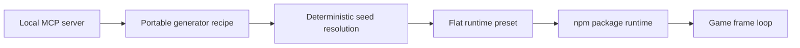

# Generative style domains

ToonLab's style domains are configuration authoring tools, not small preset
catalogs. A developer defines a domain, chooses a nonzero seed in the 32-bit seed
space, locks the decisions that already work, and keeps generating. The same
recipe can therefore produce thousands or millions of reproducible candidates,
and applications can register new families, operators, graph nodes, events, and
layer types without changing ToonLab's built-in lists.

## Status (2026-07 triage)

The dedicated browser labs for these domains were removed from the labs grid:
behavioral domains (camera, game feel, motion) cannot be judged against a demo
stage, and the visual ones are curated via MCP batches + review instead. The
domains themselves were triaged by one test — *does this simplify a Three.js
game developer's life today?*

| Domain | npm export | Lab | Notes |
|---|---|---|---|
| Post & color | ✅ `./post` | removed (future feature) | Curate presets via MCP; needs 3–5 owner-reviewed presets |
| Camera | ✅ `./camera` | removed (future feature) | Ships as a code library; needs README quickstart |
| Game feel | ✅ `./game-feel` | removed (future feature) | Ships as a code library; needs README quickstart |
| Lighting | ✅ `./lighting` | ✅ `/lighting-lab/` | Styles + fixtures; see [lighting.md](lighting.md) |
| Motion | ⏸ held (source at `src/motion/`) | removed (future feature) | Returns when a demo drives real GLTF clips end-to-end |
| Soundscape | ⏸ held (source at `src/soundscape/`) | removed (future feature) | Rethink as adaptive mixing over curated audio assets |
| Biome | ❌ cut (source at `src/biome/`) | removed (future feature) | Value lives in `stylizedTerrain`/`stylizedWorld`, already exported |
| UI theme | ❌ removed entirely | removed (future feature) | Out of scope for a Three.js game library; recoverable from history |

The product boundary is:



- MCP provides design-time recipe creation, validation, batch generation, and
  `.toonlab/` persistence to coding agents.
- The npm package owns shipping runtime behavior. It accepts resolved presets,
  enforces relevant quality budgets, exposes update/configure/regenerate and
  dispose lifecycle methods, and never depends on a lab UI.

## One open generator contract

Every generator recipe is a versioned JSON document with the same core fields:

```js
{
  type: 'toonlab/biome-generator',
  version: 1,
  id: 'painted-valley',
  label: 'Painted Valley',
  seed: 4635,
  basePreset: 'outdoorGameplay',
  configuration: {},
  domains: {
    terrain: {
      morphology: {
        rolling: {
          amp: { $type: 'range', min: 8, max: 42, step: 0.25 },
        },
      },
    },
  },
  locks: ['terrain.palette.meadow'],
}
```

Domain leaves support continuous ranges, weighted choices, booleans, colors,
and constants. A domain can be narrowed, widened, replaced, or extended with
new paths. Named random streams make a result deterministic and keep unrelated
settings stable when another branch is added. Locks preserve selected paths
while the remaining paths continue to vary.

The result of generation is a flat, versioned preset. Runtime code does not
sample a domain every frame. This keeps shipping behavior deterministic,
serializable, debuggable, and inexpensive.

## The domains

### Post & color

**Shipped in npm; lab removed (future feature).** Authors color grade, bloom,
outline, vignette, depth cue, motion blur, and vertical grade together so the
result reads as one look.

- Open generation: every feature flag and numeric/color parameter is a domain;
  custom post families and ordinary runtime presets are registerable.
- Runtime: `createPostProcessingPipeline` applies the resolved settings, lazily
  allocates the pyramid bloom chain, skips inactive passes, reports render-target
  statistics, resizes safely, and disposes owned GPU resources.
- Budgets: mobile removes depth-heavy effects and limits bloom; balanced limits
  simultaneous depth consumers; cinematic preserves the authored intent.

Import from `@call-me-sensei/toonlab/post`.

### Camera

**Shipped in npm; lab removed (future feature).** Builds a stack of camera
operators instead of selecting one hard-coded camera type. Follow, framing,
collision, damping, procedural noise, impulses, and lens behavior can be
composed or extended.

- Open generation: archetypes seed an editable domain; new generator
  archetypes and runtime operator factories can be registered.
- Runtime: `createCameraRig` evaluates the operator stack without editor state;
  `createCameraDirector` blends between rigs and `addImpulse` handles event
  response without coupling gameplay code to camera math.
- Scale: one resolved operator stack is evaluated per active camera. Noise and
  impulses are time-based and no candidate generation occurs in the frame loop.

Import from `@call-me-sensei/toonlab/camera`.

### Motion (held — future feature)

**Held out of the npm exports; lab removed.** The runtime survives at
`src/motion/` (verified by `verify:motion`) but does not ship until a demo
drives real GLTF clips on a real character end-to-end. Authors an arbitrary
animation graph, not a finite animation menu. Clip slots keep game assets
separate from reusable locomotion logic.

- Open generation: recursive 1D/2D/weighted blend nodes, any number of states,
  transitions, parameters, layers, masks, and clip slots; procedural harmonic,
  keyframe, and Three.js clip samplers share one pose contract.
- Runtime: `createMotionController` evaluates transitions and layered poses,
  supports root-motion policies and stepped/smooth cadence, and applies results
  through a replaceable rig adapter.
- Scale: graph validation catches missing slots and transition references
  before runtime. Generation changes timing/style parameters while preserving
  arbitrary user graph topology.

### UI Theme Lab (removed — future feature)

UI theming (semantic token generation, contrast auditing, scoped CSS export)
was removed from the package and the labs grid: it serves web UI authoring, not
Three.js game development, so it sits outside ToonLab's scope. The domain may
return as a separate product if game-HUD theming becomes a real need. The last
implementation lived at `src/ui-theme/` + `labs/ui-theme-lab/` (removed
2026-07; recoverable from history).

### Biome (cut — future feature)

**Export cut; lab removed.** The runtime at `src/biome/` is a lifecycle wrapper
that hard-requires ToonLab's own renderer/scene, so it is not consumable as a
standalone package export; the underlying value (`stylizedTerrain`,
`stylizedWorld`) is already exported from the package root. Treated a biome as
continuous terrain morphology plus a linked palette, water, atmosphere, and
vegetation system.

- Open generation: terrain height/depth/frequency/terracing/islands, palette
  endpoints, water colors, fog, grass/flower/tree density and size, and wind
  are domain values; new terrain archetypes and biome families are registerable.
- Runtime: `createBiomeRuntime` constructs the terrain and stylized world,
  exposes race-safe asynchronous regeneration, updates world systems, reports
  scene statistics, and owns disposal.
- Budgets: mobile, balanced, and cinematic cap terrain segments and vegetation
  radius/density/spacing so authored density never defeats the target device.

### Soundscape (held — future feature)

**Held out of the npm exports; lab removed.** The runtime survives at
`src/soundscape/` (verified by `verify:soundscape`) but purely synthesized
ambience has a quality ceiling below the asset bar; the likely return path is
adaptive mixing over curated audio assets. A procedural audio graph that can
use synthesized layers immediately and resolve project audio through an asset
resolver later.

- Open generation: any number of buses, layers, adaptive parameters,
  modulation mappings, snapshots, and transitions; both generator families and runtime
  layer factories are registerable.
- Runtime: `createSoundscapeRuntime` creates its `AudioContext` lazily after a
  user gesture, owns Web Audio nodes, transitions without rebuilding every
  frame, exposes adaptive inputs, and disposes or closes owned resources.
- Budgets: quality tiers cap nodes, layers, and voices. The runtime reports
  skipped layers rather than silently exceeding its budget.

### Game feel

**Shipped in npm; lab removed (future feature).** Maps named gameplay events to
coordinated response graphs. It is the integration layer for impact, not
another VFX asset catalog.

- Open generation: event definitions and effect factories are registries;
  projects can add `parry`, `harvest`, `dialogueBeat`, or any other event and
  compose built-in camera punch, hit-stop/time warp, squash, flash, audio, and
  haptics; custom effect factories can connect project VFX or particles.
- Runtime: `createGameFeelRuntime` schedules effects on scaled and unscaled
  clocks, enforces cooldown/concurrency rules, returns gameplay delta after
  time effects, and drives replaceable adapters instead of assuming a renderer
  or input library.
- Safety: haptics and audio are capability-gated; an adapter returning `false`
  explicitly declines so fallback diagnostics remain honest. Unsupported
  effects do not consume supported-effect capacity, errors are isolated,
  trigger/drop statistics are exposed, and disposal restores time/camera/UI
  state. Runtime quality tiers can tighten recipes, resolved presets, or raw
  settings.

Import from `@call-me-sensei/toonlab/game-feel`.

### Lighting Lab

`/lighting-lab/` authors the game's lighting identity as two generative
artifacts instead of per-scene light configuration: **lighting styles**
(`toonlab/lighting-style` — the full day as one curve: sun kelvin/intensity
per hour, sun path, ambient policy, fog palette, exposure philosophy, shadow
policy) and **light fixtures** (`toonlab/light-fixture` — reusable practicals
like street lamps and lanterns with seeded per-placement variation, flicker,
and day/night schedules).

- Open generation: style families (`anime-day`, `call-me-sensei`, `golden`,
  `noir-neon`, `pastel-overcast`) and fixture families (`warm-practical`,
  `cms-practical`, `flame`, `neon`) are registries on the shared domain
  grammar; subtree locks (`sun`, `atmosphere`, `exposure`) survive reseeds.
- Runtime: `createLightingSystem` applies a style + fixtures to any scene or
  stylized world — `setTimeOfDay(hour)` moves the whole look along the day
  cycle, `place(fixture, position, { seed })` realizes budget-managed lights
  with deterministic variation, `setWeatherModulation` is the single hook for
  weather, and `dispose()` restores captured fog/exposure/sun state. Area
  lights gate on LTC lookup-texture loading instead of crashing node backends.
- Preview scenes: outdoor, interior, and city-night stages with a time-of-day
  scrubber and weather modulation presets, so a style is judged standing next
  to a lantern at night, not only at editor noon.

Import from `@call-me-sensei/toonlab/lighting`.

## MCP authoring

The local MCP server exposes four tools shared by the shipped domains (post,
camera, game feel, lighting styles, light fixtures):

- `list_style_labs` returns runtime imports/APIs, extension families,
  and generation capabilities.
- `create_style_recipe` creates and optionally saves a recipe below
  `.toonlab/creations/`.
- `generate_style_presets` resolves one to 64 consecutive seeds in one call,
  validates every result, and optionally saves the deterministic batch.
- `validate_style_document` validates either an editable recipe or flat preset.

For example, an agent can create a broad post-look recipe, lock the grade after
review, generate seeds 2000–2063, and save the batch without inventing a finite
catalog of look names. See [Local MCP and workspace](mcp.md) for connection
instructions.

## Runtime example

```js
import {
  createPostGeneratorRecipe,
  createGeneratedPostPresetDocument,
  createPostProcessingPipeline,
} from '@call-me-sensei/toonlab/post';

// Usually authored and saved via MCP.
const recipe = createPostGeneratorRecipe('soft-anime', { seed: 4635 });
const preset = createGeneratedPostPresetDocument(recipe, { quality: 'balanced' });

const post = createPostProcessingPipeline({
  camera,
  renderer,
  scene,
  settings: preset.settings,
});

renderer.setAnimationLoop(() => {
  post.render(clock.getDelta());
});

// post.dispose();
```

Applications may ship recipes when runtime re-rolling is a feature, or resolve
and check in presets when exact art direction is required. Both paths use the
same npm implementation.

## Engine practices adopted

The architecture follows useful patterns from established engines while
remaining native to Three.js:

- Unreal Engine's Procedural Content Generation framework separates reusable
  graphs, subgraphs, inspection/debugging, and editor/runtime generation. The
  ToonLab equivalent is an extensible recipe domain plus a flat inspected
  result.
- Unreal Engine MetaSounds treats audio as a procedural runtime graph with
  reusable patches and parameterized inputs. Soundscape uses the same graph and
  registry mindset with explicit Web Audio budgets.
- Unity Volume profiles separate reusable effect settings from local runtime
  overrides. ToonLab recipes, resolved presets, locks, and quality overrides
  serve the same separation.
- Unity Cinemachine composes camera behaviors and provides separate impulse and
  noise systems. ToonLab's camera domain uses an operator stack with event-driven impulses
  and deterministic noise.
- Unity Audio Mixer snapshots support controlled transitions between mixes;
  Soundscape transitions buses and layers rather than hard-switching graphs.
- Unity's Input System makes haptic support an optional device capability;
  Game Feel uses adapters and capability checks rather than assuming a gamepad.

Primary references:

- [Unreal Engine Procedural Content Generation Framework](https://dev.epicgames.com/documentation/en-us/unreal-engine/procedural-content-generation-framework-in-unreal-engine)
- [Unreal Engine MetaSounds](https://dev.epicgames.com/documentation/unreal-engine/metasounds-the-next-generation-sound-sources-in-unreal-engine?lang=en-US)
- [Unity URP Volumes](https://docs.unity3d.com/ja/Packages/com.unity.render-pipelines.universal%4014.0/manual/Volumes.html)
- [Unity Cinemachine](https://docs.unity3d.com/ja/current/Manual/com.unity.cinemachine.html)
- [Unity Cinemachine Impulse](https://docs.unity3d.com/ja/Packages/com.unity.cinemachine%402.6/manual/CinemachineImpulse.html)
- [Unity Audio Mixer snapshot transitions](https://docs.unity3d.com/jp/current/ScriptReference/Audio.AudioMixer.TransitionToSnapshots.html)
- [Unity Input System gamepad haptics](https://docs.unity3d.com/ja/Packages/com.unity.inputsystem%401.4/api/UnityEngine.InputSystem.Gamepad.html)
